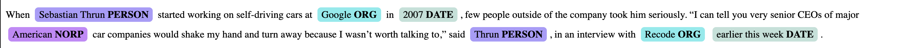
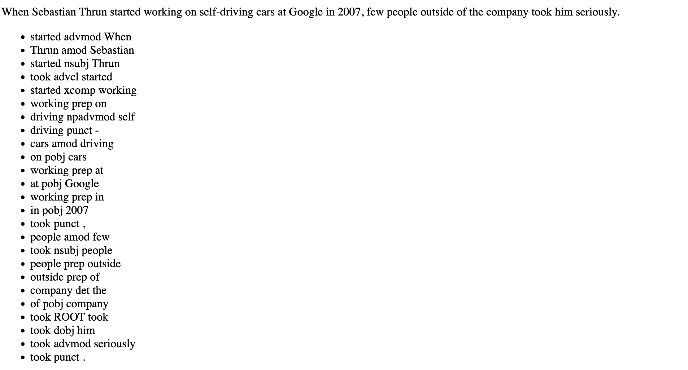
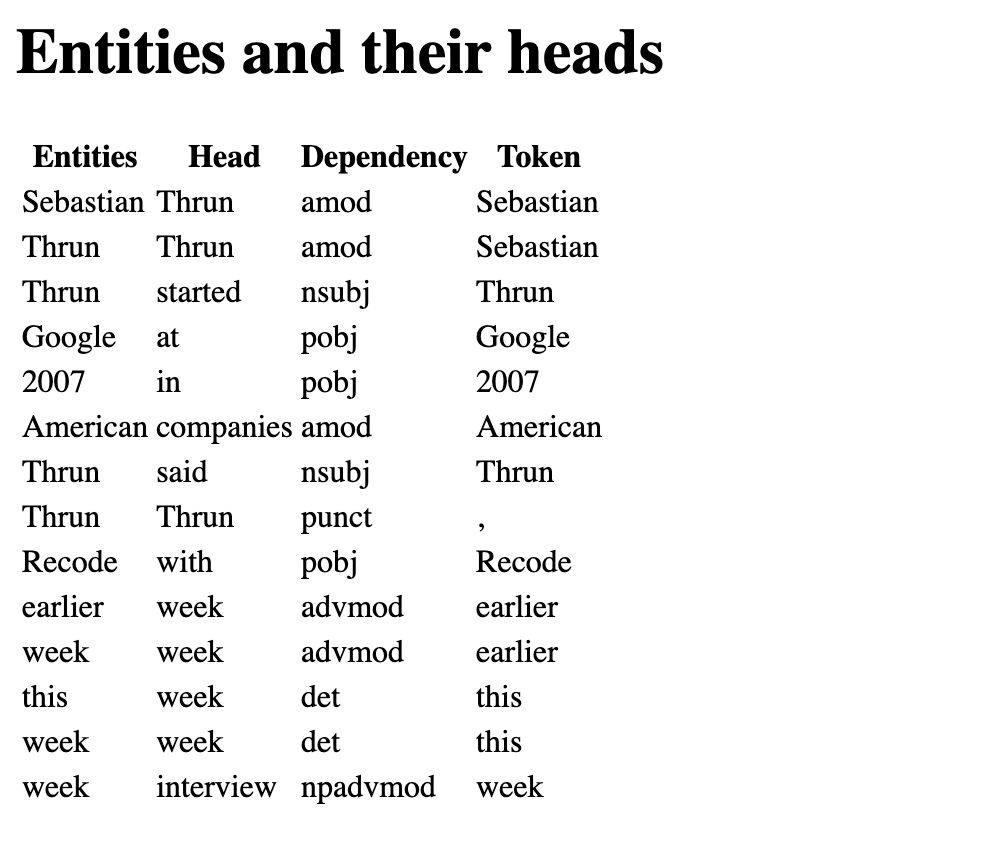

### flask

```bash
$ cd flask
$ source flask/bin/activate
$ export FLASK_APP=app_flask.py
$ flask run
```

After accessing the [website](http://127.0.0.1:5000/get). After sending a request one should see something like this for the named entity part:



The results of the dependency parse are also presented and for each sentence one should see something like:



For this assignment, a database backend is integrated into the existing code. The extracted entities are stored and also the relationships they are associated with. Here's a screenshot of the website, displaying the entities and relationships that are fetched from the database.




