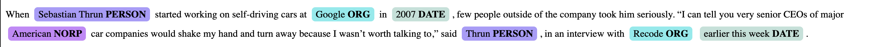
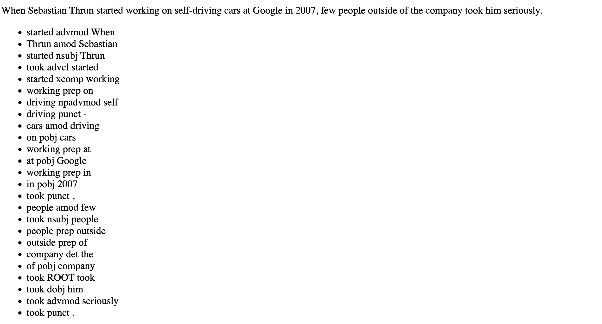
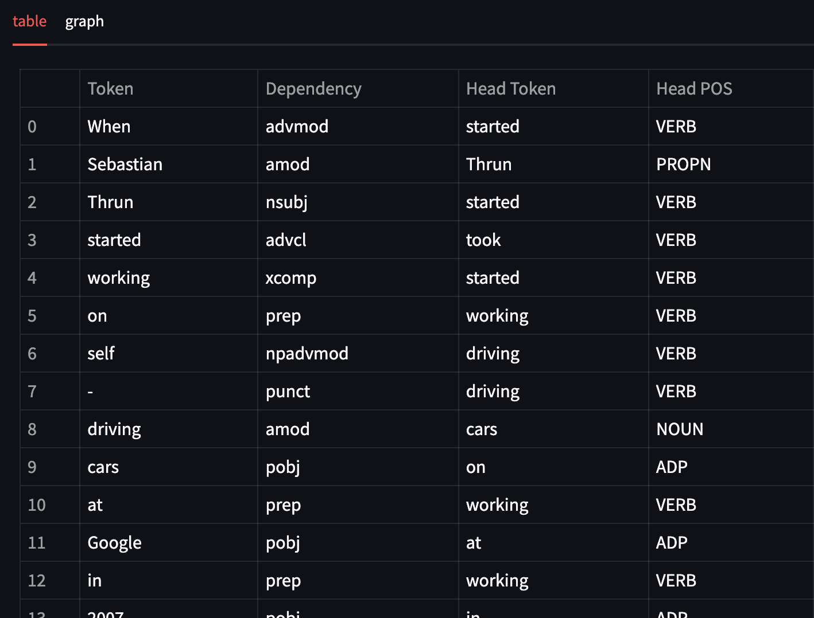
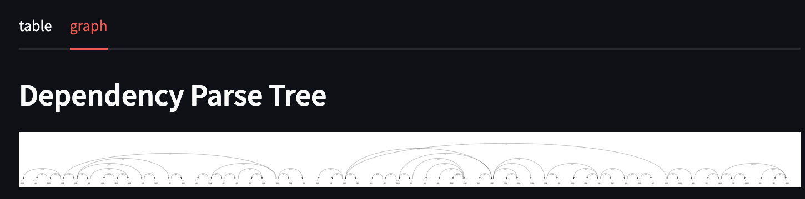
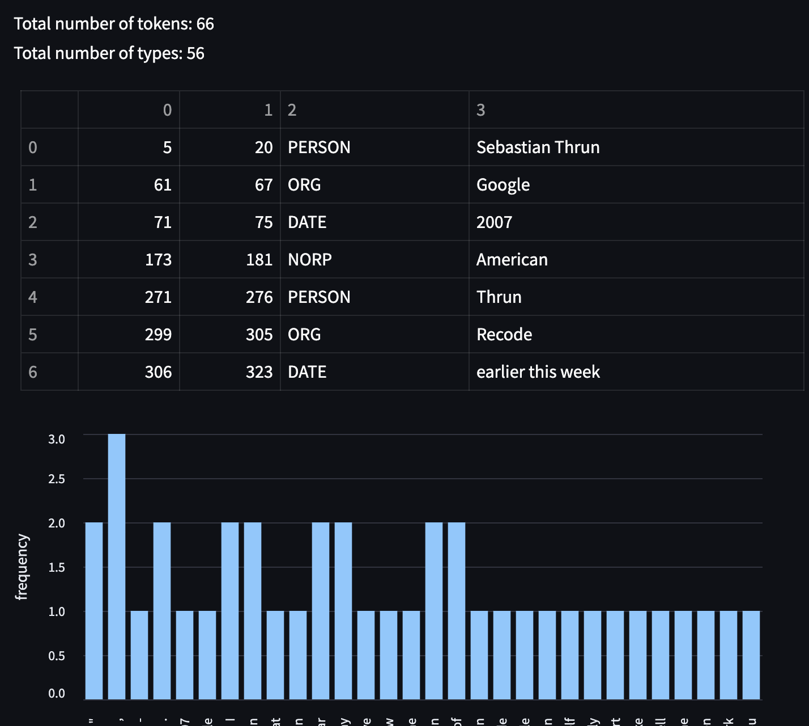

### fastapi

```bash
$ cd fastapi
$ source fastapi/bin/activate
$ uvicorn app_fast:app --reload
$ curl http://127.0.0.1:8000
$ curl http://127.0.0.1:8000/ner -H "Content-Type: application/json" -d@input.txt
$ curl http://127.0.0.1:8000/dep -H "Content-Type: application/json" -d@input.txt
```

APIs also accept a pretty parameter:

```bash
$ curl http://127.0.0.1:8000?pretty=true
$ curl http://127.0.0.1:8000/ner?pretty=true -H "Content-Type: application/json" -d@input.json
$ curl http://127.0.0.1:8000/dep?pretty=true -H "Content-Type: application/json" -d@input.json
```
#### docker

To build the Docker image, run the following command:

```
docker run -d -p 8080:8080 my-fastapi-app
```


### flask

```bash
$ cd flask
$ source flask/bin/activate
$ export FLASK_APP=app_flask.py
$ flask run
```

After accessing the [website](http://127.0.0.1:5000/get). After sending a request one should see something like this for the named entity part:



The results of the dependency parse are also presented and for each sentence one should see something like:



#### docker

To build the Docker image, run the following command:

```
docker run -d -p 5000:5000 my-flask-app
```

### streamlit

```bash
$ cd streamlit
$ source streamlit/bin/activate
$ streamlit run app_streamlit.py
```

To access Streamlit application, point your browser to http://localhost:8501/. It shows the result of spaCy NER in a table and a bar chart of word frequencies.

spacy NER in a table



dependency tree



the bar chart of word frequencies



`The required Python version 3.11.6`

#### docker

To build the Docker image, run the following command:

```
docker run -d -p 8501:8501 my-streamlit-app
```


